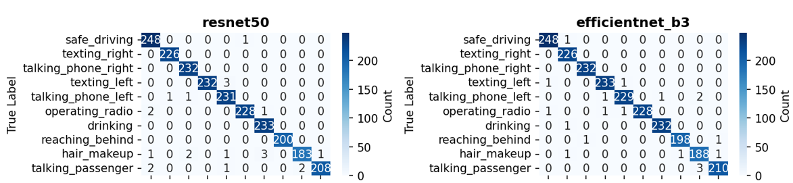
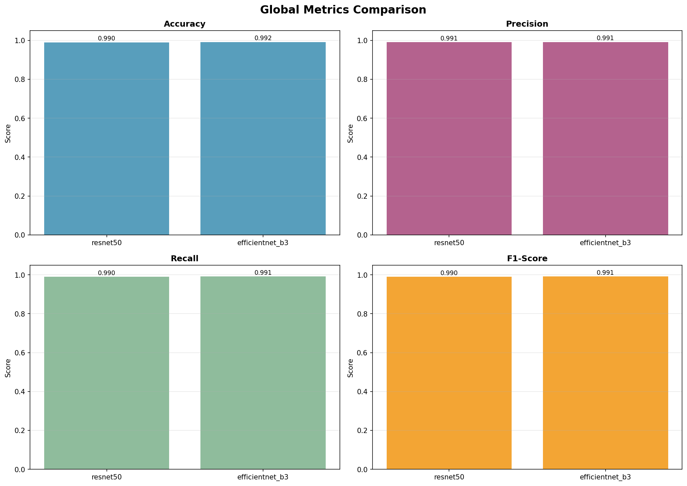
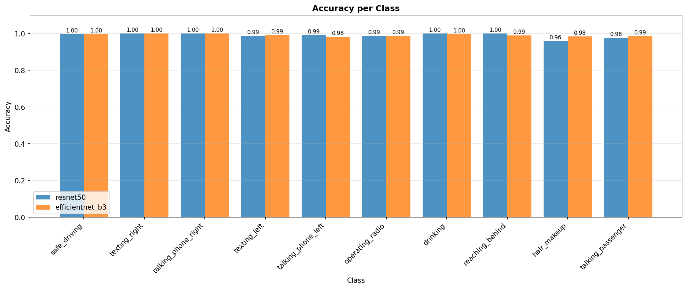
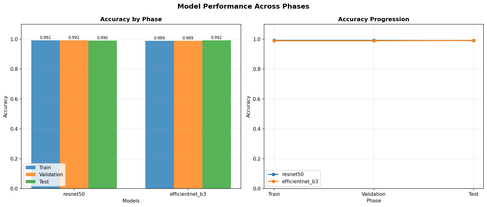

# DriverGuard — Driver Behavior Classification System

> An AI-powered system that classifies driver behavior from images using deep learning, served through a REST API with a real-time React dashboard.


## Overview

DriverGuard detects distracted driving behaviors from images and assigns a risk level to each detection. It supports two production-ready models trained on the State Farm Distracted Driver dataset.

### Detection Classes

| ID | Behavior | Risk |
|----|----------|------|
| 0 | Safe Driving | Safe |
| 1 | Texting — Right Hand | High |
| 2 | Talking on Phone — Right | High |
| 3 | Texting — Left Hand | High |
| 4 | Talking on Phone — Left | High |
| 5 | Operating Radio | Medium |
| 6 | Drinking | Medium |
| 7 | Reaching Behind | Medium |
| 8 | Hair and Makeup | Low |
| 9 | Talking to Passenger | Low |

## Models

| Model | Val Accuracy | Test Accuracy |
|-------|-------------|---------------|
| EfficientNet-B3 | 98.88% | **99.15%** |
| ResNet50 | 99.15% | 99.02% |

Both models were trained for 30 epochs with data augmentation, batch normalization, label smoothing, and learning rate scheduling.

## Project Structure

```
Driver_Gesture_Detection_System/
├── config/
│   ├── training.yaml           # Training hyperparameters
│   ├── model.yaml              # Model architecture config
│   └── class_mapping.yaml      # Class index to name mapping
├── checkpoints/                # Model weights (not tracked in git)
│   ├── efficientnet_b3_best.pth
│   └── resnet50_best.pth
├── src/
│   ├── main.py                 # FastAPI application
│   ├── prediction.py           # Inference pipeline
│   ├── preprocess.py           # Image preprocessing and dataset
│   ├── train_classifier.py     # Model training logic
│   └── evaluate.py             # Evaluation and visualizations
├── frontend/
│   ├── src/app/App.tsx         # React dashboard
│   ├── Dockerfile
│   └── nginx.conf
├── notebooks/
│   └── pipeline.ipynb          # Google Colab training notebook
├── docs/screenshots/
├── results/
│   ├── metrics/
│   └── visualizations/
├── Dockerfile
├── docker-compose.yml
└── requirements.txt
```

## Quick Start

### Docker (Recommended)

**Prerequisites:** [Docker Desktop](https://www.docker.com/products/docker-desktop) installed and running.

```bash
git clone https://github.com/Hassan-essoufi/Driver-Gesture-Classification-System
cd Driver_Gesture_Detection_System
```

> Model checkpoints are not included due to file size. Place them in `checkpoints/` before building:
> `checkpoints/resnet50_best.pth` and `checkpoints/efficientnet_b3_best.pth`

```bash
docker compose up --build
```

| Service | URL |
|---------|-----|
| Frontend | http://localhost |
| Backend API | http://localhost:8000 |
| API Docs | http://localhost:8000/docs |

```bash
docker compose down
```

### Local Development

**Backend**

```bash
python -m venv venv
venv\Scripts\activate        # Windows
source venv/bin/activate     # Linux/Mac

pip install -r requirements.txt
cd src && python main.py
```

**Frontend**

```bash
cd frontend
npm install
npm run dev                  # runs at http://localhost:5173
```

## API Reference

### `POST /predict`

Classify a driver image.

| Parameter | Location | Value |
|-----------|----------|-------|
| `model_name` | Query param | `resnet50` or `efficientnet_b3` |
| `file` | Form data | JPG, PNG, WebP — max 5MB |

```json
{
  "class": "Safe Driving",
  "label_id": 0,
  "confidence": 0.9921
}
```

### `GET /`

Health check — returns `{"status": "ok"}`.

## Training Techniques

### Optimizer

- **AdamW** — learning rate `0.0003`, weight decay `0.0005`

### Learning Rate Scheduling

- **ReduceLROnPlateau** — factor `0.2`, patience `3` epochs, min LR `1e-7`

### Regularization

| Technique | Detail |
|-----------|--------|
| Dropout | 0.4 in the classifier head |
| Batch Normalization | After the hidden linear layer |
| Weight Decay | L2 via AdamW — `0.0005` |
| Label Smoothing | `0.1` — prevents overconfident predictions |
| Early Stopping | Patience of `7` epochs on validation accuracy |
| Frozen Backbone | Only the classifier head is trained |

### Data Augmentation

Applied to training splits only:

| Transform | Parameters |
|-----------|------------|
| Random Horizontal Flip | p = 0.5 |
| Random Rotation | 10 degrees |
| Color Jitter | brightness=0.2, contrast=0.2, saturation=0.2, hue=0.05 |
| ImageNet Normalization | mean=[0.485, 0.456, 0.406], std=[0.229, 0.224, 0.225] |

### Transfer Learning

ImageNet pretrained backbone — frozen. Only the custom head is trained:

```
Backbone -> Flatten -> Linear(512) -> BatchNorm -> ReLU -> Dropout(0.4) -> Linear(10)
```

## Results

| Metric | ResNet50 | EfficientNet-B3 | Best |
|--------|----------|-----------------|------|
| Accuracy | 99.02% | **99.15%** | EfficientNet-B3 |
| Precision | 99.05% | **99.13%** | EfficientNet-B3 |
| Recall | 98.96% | **99.13%** | EfficientNet-B3 |
| F1-Score | 99.00% | **99.13%** | EfficientNet-B3 |

**Best model: EfficientNet-B3** — average score 99.14%

**Confusion Matrices**


**Global Metrics Comparison**


**Accuracy per Class**


**Train / Val / Test Phase Comparison**


## Screenshots

**Dashboard**


**Analyze — Drinking - Medium Risk**


**History**


## Training on Google Colab

Open `notebooks/pipeline.ipynb` in Colab with a GPU runtime.

1. Mount Google Drive
2. Copy dataset to local SSD — ~10x faster I/O than Drive reads
3. Train both models with early stopping and checkpointing
4. Evaluate on test set — results saved to Drive

Download the `.pth` files after training and place them in `checkpoints/`.

## Configuration

| Variable | Default | Description |
|----------|---------|-------------|
| `HOST` | `0.0.0.0` | Server host |
| `PORT` | `8000` | Server port |
| `RELOAD` | `False` | Auto-reload (dev only) |
| `THRESHOLD` | `0.7` | Minimum confidence threshold |
| `MAX_FILE_SIZE_MB` | `5` | Max upload size in MB |
| `ALLOWED_ORIGINS` | `*` | CORS allowed origins |

Model and training behavior is tunable via `config/training.yaml` and `config/model.yaml`.

## Tech Stack

| Layer | Tools |
|-------|-------|
| Backend | Python, FastAPI, PyTorch, Uvicorn |
| Frontend | React, TypeScript, Vite, Tailwind CSS, Recharts |
| Models | EfficientNet-B3, ResNet50 (torchvision) |
| Deployment | Docker, Docker Compose, nginx |

## Author

**Hassan Essoufi**
- GitHub: [@Hassan-essoufi](https://github.com/Hassan-essoufi)
- Email: hassanessoufi2004@gmail.com

## ⭐ Note

If you find this project useful, consider giving it a star ⭐, it helps a lot!
